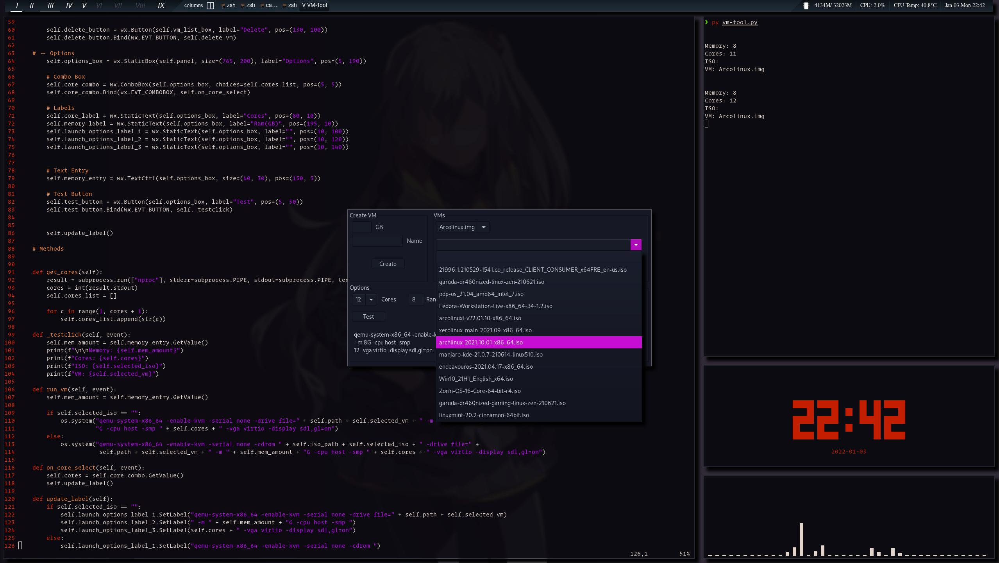

I got tired of trying to remember the QEMU commands when creating a VM
so I created this tool. It is able to create a new img with the click
of a button. Couple of clicks later and a new VM is running.

I still need to explore QEMU some more to learn some new commands so
that I can add them to the tool. Most important thing I still need to
add is a popup window to warn if you're about to delete a VM. 

